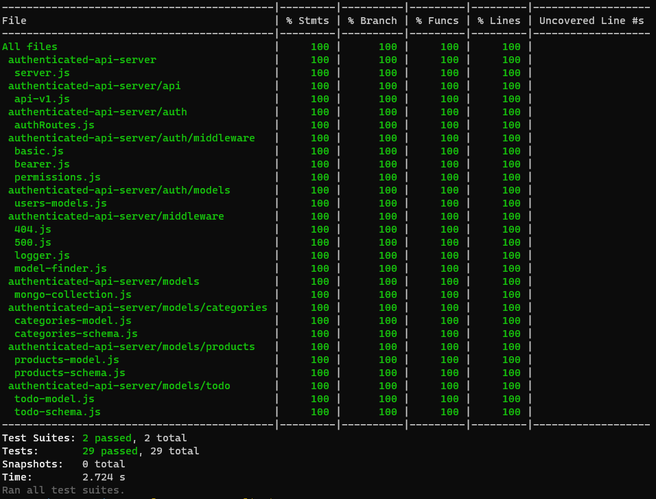

# LAB - Authenticated API Server

## Authenticated API

### Author: Kory Jackson

### Setup

#### `.env` requirements

- `PORT` - 3000

#### Running the app

- `npm start`
- in terminal `http post :3000/signup username=ENTERHERE password=ENTERHERE role=(guest, author, editor, admin)`
  - Returns User Object with token
- endpoint `post :3000/signin -a username:password`
  - returns user token
- endpoint ``

#### Tests

- Unit Tests: `npm test`
- tests report 

#### UML

- None available